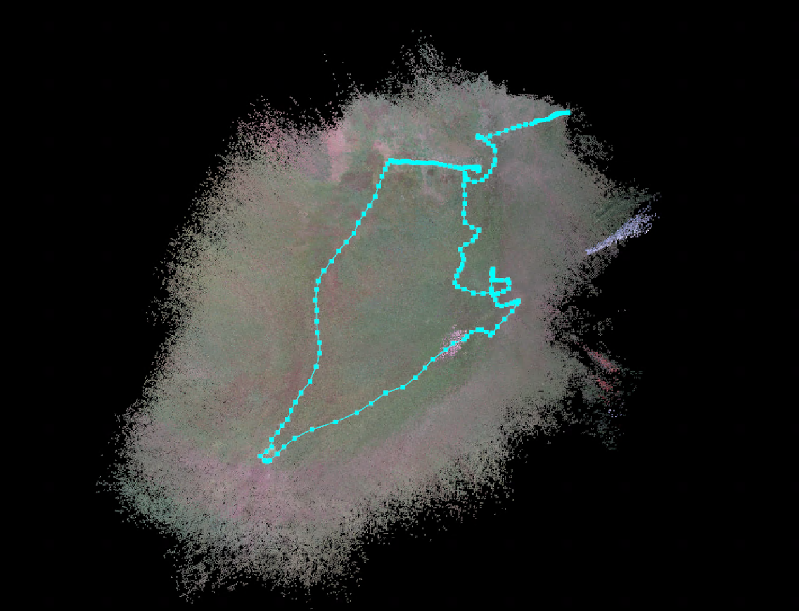
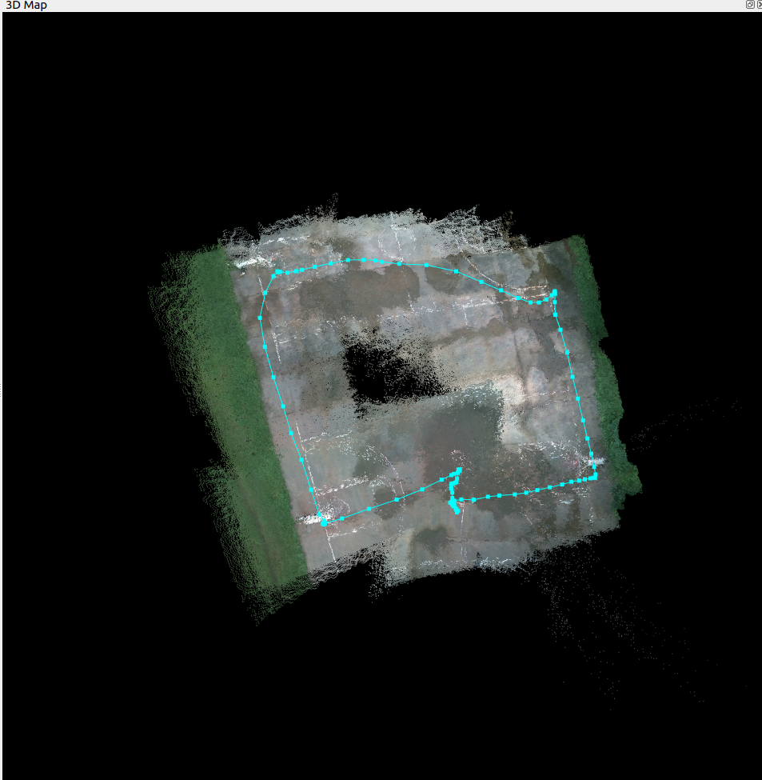
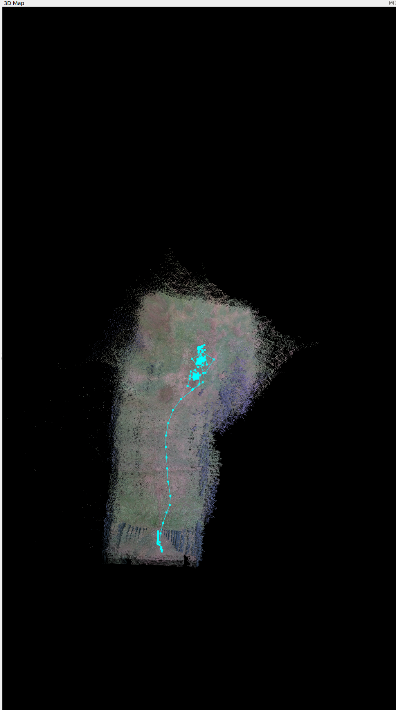
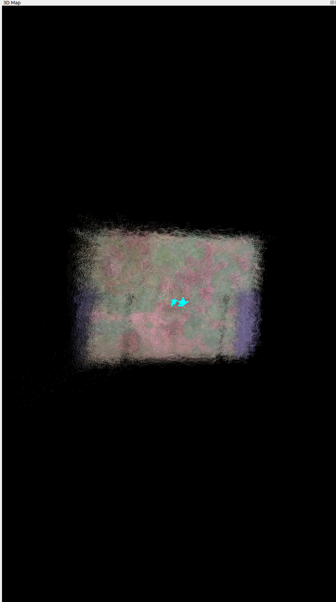

## ROS 2 Humble Setup Guide (Ubuntu 22.04 LTS)

## I. ROS 2 Humble Setup or run

```bash
    ./install.sh
```

### **1. Set Locale**

Before installing ROS 2, ensure your system locale is set to UTF-8.

```bash
locale  # check for UTF-8

sudo apt update && sudo apt install locales
sudo locale-gen en_US en_US.UTF-8
sudo update-locale LC_ALL=en_US.UTF-8 LANG=en_US.UTF-8
export LANG=en_US.UTF-8

locale  # verify settings
```

### **2. Setup Sources**

To add the ROS 2 apt repository, enable the Ubuntu Universe repository.

```bash
sudo apt install software-properties-common
sudo add-apt-repository universe
```

Add the ROS 2 GPG key with apt.

```bash
sudo apt update && sudo apt install curl -y
sudo curl -sSL https://raw.githubusercontent.com/ros/rosdistro/master/ros.key -o /usr/share/keyrings/ros-archive-keyring.gpg

echo "deb [signed-by=/usr/share/keyrings/ros-archive-keyring.gpg] http://packages.ros.org/ros2/ubuntu $(lsb_release -cs) main" | sudo tee /etc/apt/sources.list.d/ros2.list > /dev/null

sudo apt update
```

### **3. Install ROS 2 Packages**

Update your apt repository caches and install ROS 2 packages.

```bash
sudo apt update
sudo apt upgrade

sudo apt install ros-humble-desktop
```

Install development tools.

```bash
sudo apt install ros-dev-tools
```

### **4. Environment Setup**

To start working with ROS 2, source the setup script in each terminal session.

```bash
source /opt/ros/humble/setup.bash
```

### **5. Try Some Examples**

**Talker-Listener Example**

Open a terminal and start a talker node:

```bash
source /opt/ros/humble/setup.bash
ros2 run demo_nodes_py talker
```

Open another terminal and start a listener node:
✅
```bash
source /opt/ros/humble/setup.bash
ros2 run demo_nodes_py listener
```

## II. OpenCV 4.8.0+ Installation for Librealsense

```bash
# Install dependencies
sudo apt update
sudo apt install -y build-essential cmake pkg-config libjpeg-dev libtiff-dev libpng-dev libgtk-3-dev libcanberra-gtk* libatlas-base-dev gfortran python3-dev

# Download OpenCV
wget -O opencv.zip https://github.com/opencv/opencv/archive/4.8.0.zip
unzip opencv.zip
cd opencv-4.8.0

# Build OpenCV
mkdir build
cd build
cmake ..
make -j$(nproc)
sudo make install
```

## III. Camera Node Setup

### **1. Clone the `realsense_ros` Repository**

```bash
git clone https://github.com/IntelRealSense/realsense-ros.git
cd realsense-ros
colcon build --symlink-install
```

### **2. Source the Workspace**

Source the newly built workspace:

```bash
source ~/realsense-ros/install/setup.bash
```

To make it persistent, add it to your `.bashrc`:

```bash
echo "source ~/realsense-ros/install/setup.bash" >> ~/.bashrc
```

### **3. Launch Camera Node (downfacing)**

To test the installation, launch the RealSense camera node:

```bash
ros2 launch realsense2_camera rs_launch.py   enable_depth:=true   enable_color:=true   enable_sync:=true   depth_module.depth_profile:=640,480,60   rgb_camera.color_profile:=640,480,60 enable_sync:=true enable_gyro:=true enable_accel:=true unite_imu_method:=2 gyro_fps:=200 accel_fps:=200

```

## IV. RTAB-Map Installation

### **1. Install RTAB-Map**

```bash
sudo apt install -y ros-humble-rtabmap-ros
```

### 2. Launch IMU node:

```bash
ros2 run imu_filter_madgwick imu_filter_madgwick_node   --ros-args   -r imu/data_raw:=/camera/camera/imu   -r imu/data:=/imu/data   -p use_mag:=false
```

### **3. Launch RTAB-Map**

```bash
ros2 launch rtabmap_launch rtabmap.launch.py   rtabmap_args:="--delete_db_on_start"   rgb_topic:=/camera/camera/color/image_raw   depth_topic:=/camera/camera/depth/image_rect_raw   camera_info_topic:=/camera/camera/color/camera_info   frame_id:=camera_link   use_sim_time:=true   approx_sync:=true   qos:=2   rviz:=false   queue_size:=100 imu_topic:=/imu/data

```


### **4. Ardupilot Parameter setup (Camera Downfacing)**

```bash
SERIAL1_PROTOCOL = 2 (MAVLink2).

SERIAL1_BAUD = 115 (115200 baud)

VISO_TYPE = 1 (mavlink)

EK3_SRC1_POSXY = 6 (ExternalNav)

EK3_SRC1_VELXY = 6 (ExternalNav)

EK3_SRC1_POSZ = 1 (Baro which is safer)

EK3_SRC1_VELZ = 6 (you can set it to 6 if 1st flight test looks good)

EK3_SRC1_YAW = 1 (Compass)


```

### **5. Run Slam node (ardupilot)**

```bash
# (downfacing camera) #need rangefinder for better position hold
python3 slam_localization_ekf.py #up to date

# for forward facing camera
python3 slam_localization_frd.py 

# for cpp run
colcon build --packages-select slam_localization --symlink-install #once
source install/setup.bash #once
ros2 run slam_localization slam_node #updated
 
```

### 6. To see Saved maps Run

```bash
rtabmap ~/.ros/rtabmap.db
```


## IV. Stereo Slam with RTABMAP

### 1. Stereo SLAM 
 #### 1. Launch camera with infra1 (left)  and infra2(right) 

```bash

ros2 launch realsense2_camera rs_launch.py enable_infra1:=true enable_infra2:=true  enable_color:=true   enable_sync:=true  rgb_camera.color_profile:=848,480,30 enable_sync:=true enable_gyro:=true enable_accel:=true unite_imu_method:=2 gyro_fps:=200 accel_fps:=200 depth_module.infra_profile:=848,480,60

```

#### 2. Launch IMU Node :

```bash
ros2 run imu_filter_madgwick imu_filter_madgwick_node   --ros-args   -r imu/data_raw:=/camera/camera/imu   -r imu/data:=/imu/data   -p use_mag:=false
```

#### 3. Launch RTABMAP for stereo 

```bash

ros2 launch rtabmap_launch rtabmap.launch.py \
   rtabmap_args:="--delete_db_on_start" \
   stereo:=true \
   left_image_topic:=/camera/camera/infra1/image_rect_raw \
   right_image_topic:=/camera/camera/infra2/image_rect_raw \
   left_camera_info_topic:=/camera/camera/infra1/camera_info \
   right_camera_info_topic:=/camera/camera/infra2/camera_info \
   frame_id:=camera_link \
   use_sim_time:=true \
   approx_sync:=true \
   qos:=2 \
   rviz:=false \
   queue_size:=100 \
   imu_topic:=/imu/data

```

### Flight Tests with RTABMAP SLAM







